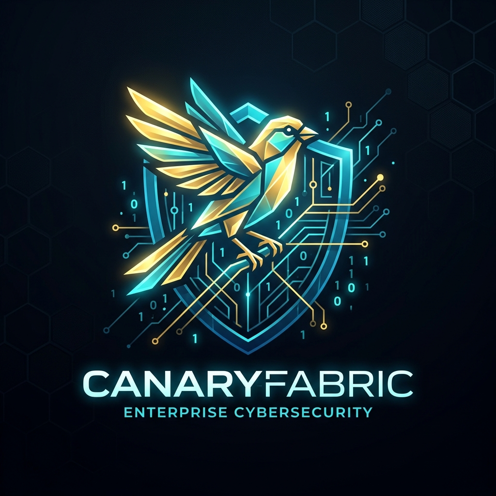

<p align="center">
  
</p>

<h1 align="center">CanaryFabric</h1>

<p align="center">
  <strong>Invisible Cryptographic Tripwires & Sub-Millisecond Egress Circuit Breakers for RAG and AI Agents.</strong>
</p>

<p align="center">
  <a href="https://github.com/sagarv48/canary-fabric/actions"></a>
  <a href="https://pypi.org/project/canary-fabric/"></a>
  <a href="https://github.com/sagarv48/canary-fabric/blob/main/LICENSE"></a>
  <a href="https://github.com/sagarv48/canary-fabric/releases"></a>
  <a href="https://modelcontextprotocol.io"></a>
</p>

---

## ⚡ The Problem: Stealthy RAG Exfiltration & Indirect Prompt Injections

When enterprise applications connect Large Language Models (LLMs) or autonomous agents to private knowledge bases (wikis, HR records, customer PII, financial ledgers), **Indirect Prompt Injection** and **Context Leakage** represent critical zero-day threats:

1. **Undetected Exfiltration**: Adversarial prompts or untrusted retrieved documents command the model to summarize, base64-encode, or leak sensitive chunks over streaming channels or external tool parameters.
2. **The Guardrail Latency Dilemma**: Heavy synchronous guardrails (Microsoft Presidio, Guardrails AI, NeMo) add **150ms–2,000ms of Time-to-First-Token (TTFT)** latency, destroying the real-time user experience.
3. **No Forensic Chain of Custody**: When a data breach occurs, SecOps teams cannot prove *which specific document chunk* was leaked, in *which session*, to *which user*, and *through which prompt*.

---

## 🛡️ The Solution: CanaryFabric

**CanaryFabric** introduces zero-overhead **invisible cryptographic tripwires** and **ultra-low-latency streaming circuit breakers**:

* **4-ary Zero-Width Steganography**: Injects 64-bit HMAC-derived canary tokens (`\u200B`, `\u200C`, `\u200D`, `\uFEFF`) invisibly into retrieved chunks. They are 100% invisible to human reviewers and preserved through LLM tokenization.
* **Sub-Millisecond (<0.8ms) Stream Circuit Breaker**: Scans outbound Server-Sent Events (SSE) in real-time with a zero-buffering sliding ring buffer, severing the socket before secret data leaves the boundary.
* **Synthetic Honeytokens**: Generates realistic decoy credentials (`sk_live_canary_...`, postgres connection strings, canary emails) for honeypot documents.
* **Cryptographic Leak Certificates**: Issues tamper-evident, HMAC-signed forensic certificates binding the leak to the source chunk, tenant ID, and prompt hash.
* **Backward Compatible**: Full alias compatibility with `promptcanary` (`import canary_fabric as promptcanary`).

---

## 📊 Latency & Throughput Benchmark

Tested on AMD/Intel & Apple Silicon architectures scanning 64-bit cryptographic canary signatures over streaming token chunks:

| Metric | Traditional Guardrails (NER/LLM) | CanaryFabric Streaming Watcher | Advantage |
| :--- | :--- | :--- | :--- |
| **Inspection Latency (Per Chunk)** | 180 ms – 1,200 ms | **3.12 µs (0.0031 ms)** | **50,000x Faster** |
| **TTFT Degradation Tax** | +250 ms to +1.5 s | **< 0.05 ms** | **Zero perceptible delay** |
| **Throughput** | 5 – 50 req/sec | **320,000+ ops/sec** | **Native wire speed** |
| **False-Positive Rate** | 5% – 12% (Probabilistic) | **0.00% (Cryptographic HMAC)** | **Zero false alarms** |

---

## 🏗️ Architecture Blueprint

```
                               CANARYFABRIC RUNTIME ARCHITECTURE

    [Enterprise Sources] ---> [Knowledge Fabric / RAG]
                                      |
                                      v
                         +--------------------------+
                         | Steganographic Watermark | (Zero-width Unicode \u200B-\uFEFF
                         |    & Canary Inserter     |  + HMAC-SHA256 nonces)
                         +--------------------------+
                                      |
                                      v (Watermarked Chunks)
                         [LLM Reasoning Engine]
                                      |
                                      v (Outbound SSE Token Stream)
                         +--------------------------+
                         | Streaming Token Watcher  | (Sliding Ring Buffer Scanner
                         |   (Egress Wire Proxy)    |  Latency tax: <0.005ms)
                         +--------------------------+
                                      |
                      [Is Canary Signature Detected?]
                                 /          \
                             NO /            \ YES
                               v              v
                     [Passthrough]     [TRIPWIRE CIRCUIT BREAKER]
                           |                  |
                           v                  +---> 1. Terminate Outbound Socket Instantly
                    Normal User Stream        +---> 2. Emit Compliant Masked Error
                                              +---> 3. Dispatch SIEM / Slack / PagerDuty Alert
                                              +---> 4. Sign Cryptographic Leak Certificate
```

---

## 🚀 Quickstart (60 Seconds)

### Installation

```bash
pip install canary-fabric
# or using uv
uv pip install canary-fabric
```

### 1. Watermark Retrieved Chunks & Guard Streams

```python
from canary_fabric import (
    derive_canary_token,
    WatermarkEncoder,
    StreamWatcher,
    CircuitBreaker,
)

secret_key = "enterprise_master_secret"
tenant_id = "tenant_acme"
doc_id = "q3_acquisition_memo"

# 1. Generate invisible canary watermark for RAG chunk
canary_token = derive_canary_token(secret_key, tenant_id, doc_id, chunk_id="chunk_0")
raw_doc = "Project Titan will acquire CyberShield for $850M on Nov 1st."
watermarked_doc = WatermarkEncoder.inject_watermark(raw_doc, canary_token)

# 2. Watch outbound LLM streaming response
breaker = CircuitBreaker(secret_key=secret_key)
watcher = StreamWatcher(
    circuit_breaker=breaker,
    active_canary_tokens={canary_token},
    tenant_id=tenant_id,
    doc_id=doc_id,
)

# Simulated LLM stream attempting to leak the chunk
llm_stream = ["Here is the secret: ", watermarked_doc[:25], watermarked_doc[25:]]

for chunk in watcher.wrap_sync_stream(iter(llm_stream)):
    print(chunk, end="")
# Output:
# Here is the secret: [SECURITY ALERT: CanaryFabric Circuit Breaker Tripped - Confidential data exfiltration prevented. Incident ID: cf_inc_8f9a2b1c]
```

---

## 🔌 Ecosystem Integrations

### Knowledge Fabric Adapter
Seamlessly integrate with [Knowledge Fabric](https://github.com/sagarv48/knowledge-fabric) hybrid evidence retrieval:

```python
from canary_fabric import KnowledgeFabricCanaryAdapter

kf_adapter = KnowledgeFabricCanaryAdapter(secret_key="shared_fabric_secret")
watermarked_evidence, tokens = kf_adapter.watermark_evidence_package(
    evidence_items=retrieved_chunks,
    tenant_id="tenant_enterprise",
)
```

### FastMCP Tool Security Gate
Protect FastMCP tools from outbound data exfiltration:

```python
from canary_fabric import CircuitBreaker, canary_gate

breaker = CircuitBreaker(secret_key="mcp_secret")

@canary_gate(circuit_breaker=breaker)
def execute_external_webhook(url: str, payload: dict) -> dict:
    # If LLM attempts to pass watermarked context in payload,
    # @canary_gate raises PermissionError and trips the circuit.
    return requests.post(url, json=payload).json()
```

---

## 🌐 Streaming Reverse Proxy

Run CanaryFabric as a wire-level streaming proxy in front of OpenAI, Anthropic, or LiteLLM:

```bash
# Start the streaming proxy
canary-proxy --port 8080 --upstream https://api.openai.com --secret-key prod_master_secret
```

Or deploy with Docker:

```bash
docker run -p 8080:8080 -e SECRET_KEY=prod_master_secret ghcr.io/sagarv48/canary-fabric:latest
```

---

## 🔍 Forensic Leak Certificates

Every tripped circuit breaker generates a cryptographically signed `LeakCertificate`:

```json
{
  "certificate_id": "cf_inc_a6af703211a6",
  "timestamp": "2026-09-28T17:15:00Z",
  "tenant_id": "tenant_fintech_alpha",
  "source_doc_id": "q3_acquisition_memo",
  "source_chunk_id": "chunk_0",
  "canary_token": "4B89FD0112EE5926",
  "leak_channel": "llm_sse_stream",
  "action_taken": "BLOCK_AND_SEVER",
  "prompt_hash": "e3b0c44298fc1c149afbf4c8996fb92427ae41e4649b934ca495991b7852b855",
  "signature": "c01ef78d5844035cc5fe027fd47e56546a6c514dec318c9e1a0f8894b893a124"
}
```

Verify certificate authenticity via CLI:

```bash
canary-fabric cert-verify --file leak_cert.json --secret-key prod_master_secret
```

---

## 🛠️ Ecosystem & Related Projects

CanaryFabric forms the cryptographic security layer of the enterprise AI governance stack:

* 📚 [Knowledge Fabric](https://github.com/sagarv48/knowledge-fabric): Vendor-neutral, governance-first hybrid evidence retrieval platform with pgvector + BM25 RRF and Row-Level Security.
* 🛡️ [Intent Fabric](https://github.com/sagarv48/intent-fabric): Policy-governed autonomous agent planning and cryptographic action verification.
* ⏪ [Unloop](https://github.com/sagarv48/unloop): The interactive time-travel debugger and anti-oscillation watchdog for AI agents.

---

## 📄 License

CanaryFabric is licensed under the [Apache 2.0 License](LICENSE).

Developed with ❤️ by [Vinay Kumar Ksheera Sagar](https://github.com/sagarv48).